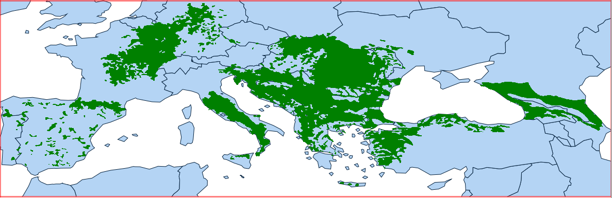
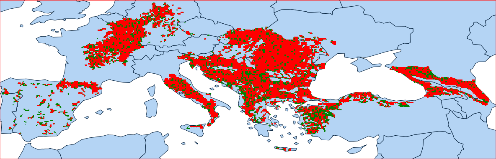

### AOH (Area of Habitat)

Developing a workflow for the systematic production of Area of Habitat (AOH)–derived metrics for terrestrial species, based on existing biodiversity and environmental datasets.

The approach is designed as a standardized transformation layer between IUCN Red List species data and downstream biodiversity indicators, with the aim of generating consistent and reproducible outputs across large numbers of species.

The workflow relies exclusively on existing data sources and established scientific products, including IUCN Red List species and habitat information, global land cover datasets (e.g. ESA Copernicus), and published habitat crosswalks (e.g. Santini et al., Lumbierres et al., Jung et al.), together with indicator frameworks developed by Juffe-Bignoli et al.

#### Quantitative approach

##### Global

A quantitative, non–spatially explicit AOH workflow is easily implementable within the standard DOPA pipeline.

Mammal species ranges (~5,800 species in IUCN Redlist 2024, each represented by a unique identifier: id_no) are flattened into a 300 m (10 arcsec) raster, tiled at 1-degree resolution, where each pixel (CID, up to ~2.5M unique identifiers) encodes combinations of species IDs (id_no).

This raster is intersected in GRASS GIS (using r.stats) with ESA Land Cover rasters for 1992 and 2022 at matching resolution, producing per-CID statistics of land cover extent and change over time.

Using the Santini et al. (2019) crosswalk, land cover classes are converted into IUCN habitat classes. Species-specific habitat preferences (filtered to terrestrial species only) from the IUCN Red List database are then applied by unnesting CID–species relationships and selecting only relevant habitat classes.

For each species (id_no), total range area is computed (both original vector and derived raster extensions are provided), along with AOH in 1992 and 2022, AOH gain/loss between the two years, and the proportion of AOH (in 2022) relative to total range extent.

*Example on carnivores*

|id_no    |order_   |family |genus|binomial        |endemic|v_range_sqkm      |r_range_sqkm      |aoh_92_sqkm       |aoh_22_sqkm       |aoh_perc_range   |aoh_gain_loss_perc  |ecosystems   |category|threatened|habitats                                                                    |
|---------|---------|-------|-----|----------------|-------|------------------|------------------|------------------|------------------|-----------------|--------------------|-------------|--------|----------|----------------------------------------------------------------------------|
|3746     |Carnivora|Canidae|Canis|Canis lupus     |NULL   |55647035.706165634|55647114.3515089  |42896749.733751416|42205872.81813306 |75.8455731442409 |-0.0161055772268631 |{terrestrial}|LC      |NULL      |{1.1,1.2,1.4,14.2,1.5,3.1,3.4,3.5,4.1,4.2,4.4,5.10,5.4,6,8.1,8.2}           |
|12519    |Carnivora|Felidae|Lynx |Lynx lynx       |NULL   |20530804.307443537|20530826.330828443|15774138.7067147  |15470636.781843588|75.35321049700453|-0.019240475217954  |{terrestrial}|LC      |NULL      |{1.1,1.4,1.5,3.3,3.4,3.5,4.4,4.7,6,8.2,8.3}                                 |
|12520    |Carnivora|Felidae|Lynx |Lynx pardinus   |NULL   |1192.2424522393212|1192.2431491049508|112.31855075601801|109.29974437799301|9.167571603162264|-0.02687718420247919|{terrestrial}|EN      |True      |{3.8}                                                                       |
|41688    |Carnivora|Ursidae|Ursus|Ursus arctos    |NULL   |24937291.660346873|24937328.201107223|22054120.44871323 |21776143.672609057|87.3234834822529 |-0.01260430116678688|{terrestrial}|LC      |NULL      |{1.1,1.2,1.4,14.1,14.2,14.3,3.1,3.3,3.4,3.5,3.6,4.1,4.2,4.4,4.5,5.3,5.4,8.2}|
|181049859|Carnivora|Felidae|Felis|Felis silvestris|NULL   |1423733.320508563 |1423734.4318734384|1149627.8889810834|1138891.6385745232|79.99326370690486|-0.00933889174876908|{terrestrial}|LC      |NULL      |{1.4,14.1,14.2,14.3,1.5,3.4,3.8,4.4,5.3,5.4,6}                              |

Preliminary results are available [Species 2024 AOH](./aoh/species_2024_range_aoh_92_22.csv).

Preliminary code is available in [Area of Habitat (AOH) quantitative code](./aoh/aoh.sql).

##### Country/Protection

In addition, the same r.stats approach is applied by integrating the CEP 2026 raster (GISCO 2024 1:1M + GISCO EEZ). This allows the statistics to be aggregated not only at species level, but also by country and within protected areas.

#### Spatial

##### Mapping

A coarse spatial representation of the phenomenon can be obtained relatively quickly by selecting, for each id_no, the land cover classes (vector polygons in PostGIS) intersecting the species range and filtering them according to the selected habitats and crosswalk tables.

##### Spatially explicit model

A fully spatially explicit model is also feasible, but it presents major constraints:

Binary remapping: each species would need to be reconstructed as an individual binary layer from the flattened land cover–intersected dataset (raster or vector), thereby losing the single-run efficiency enabled by the current flattening approach.

*Felis silvestris 2024 range (green)*

*Felis silvestris 1992 aoh (red), overlapped on species range (green)*

*Felis silvestris 2022 aoh (yellow), overlapped on 1922 aoh (red) and species range (green)*

Fully vector-based implementation: even if used only as an intermediate processing step, the workflow would generate several billion records, requiring a substantially more powerful and dedicated computing infrastructure than is currently available.
