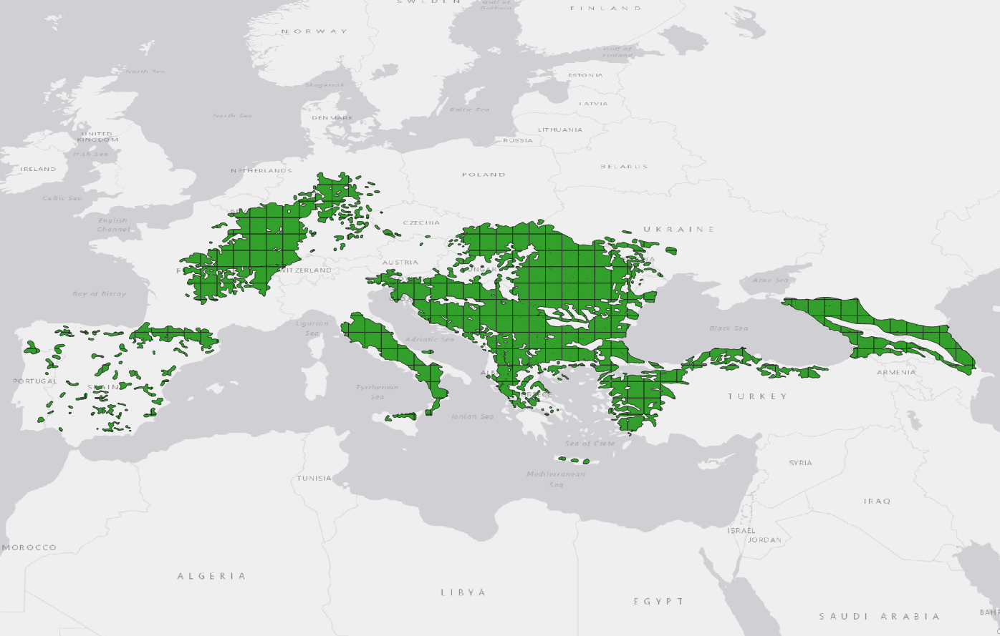
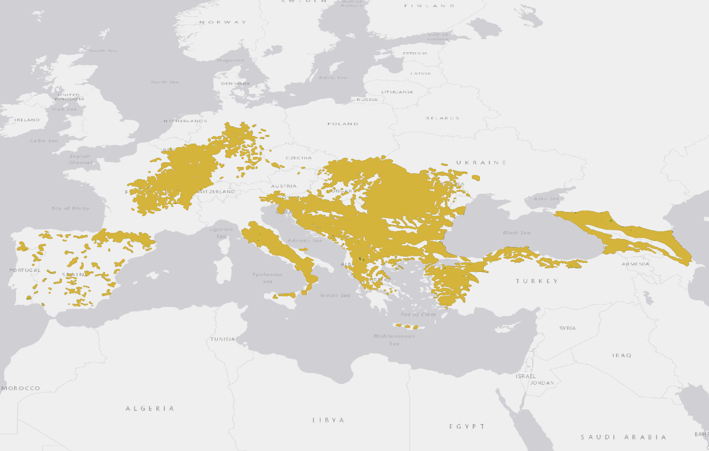
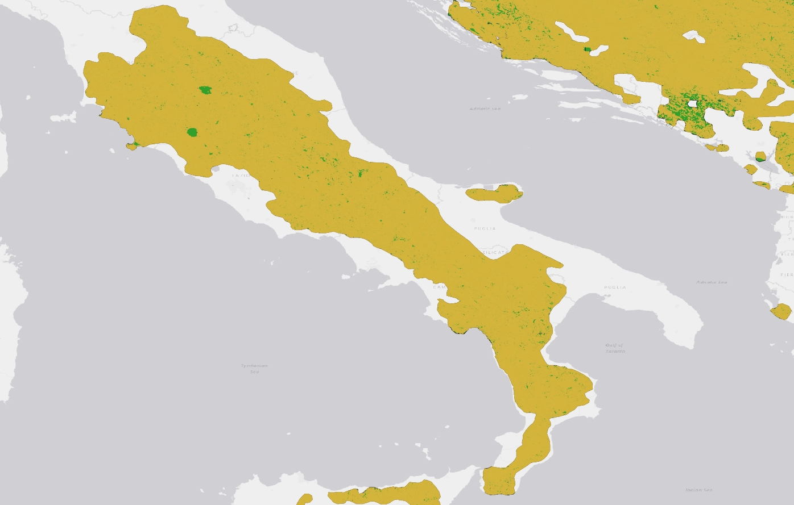

### AOH (Area of Habitat)

Developing a workflow for the systematic production of Area of Habitat (AOH)–derived metrics for terrestrial species, based on existing biodiversity and environmental datasets.

The approach is designed as a standardized transformation layer between IUCN Red List species data and downstream biodiversity indicators, with the aim of generating consistent and reproducible outputs across large numbers of species.

The workflow relies exclusively on existing data sources and established scientific products, including IUCN Red List species and habitat information, global land cover datasets (e.g. ESA Copernicus), and published habitat crosswalks (e.g. Santini et al., Lumbierres et al., Jung et al.), together with indicator frameworks developed by Juffe-Bignoli et al.

#### Quantitative approach

##### Global

A quantitative, non–spatially explicit AOH workflow is easily implementable within the standard DOPA pipeline.

Mammal species ranges (~5,800 species in IUCN Redlist 2024, each represented by a unique identifier: id_no) are flattened into a 300 m (10 arcsec) raster, tiled at 1-degree resolution, where each pixel (CID, up to ~2.5M unique identifiers) encodes combinations of species IDs (id_no).

This raster is intersected in GRASS GIS (using r.stats) with ESA Land Cover rasters for 1992 and 2022 at matching resolution, producing per-CID statistics of land cover extent and change over time.

Using the Santini et al. (2019) crosswalk, land cover classes are converted into IUCN habitat classes. Species-specific habitat preferences (filtered to terrestrial species only) from the IUCN Red List database are then applied by unnesting CID–species relationships and selecting only relevant habitat classes. Additional environmental layers can further refine the definition of AOH, including digital elevation models (DEM), climatic zonation layers, and other relevant environmental constraints.

For each species (id_no), total range area is computed (both original vector and derived raster extensions are provided), along with AOH in 1992 and 2022, AOH gain/loss between the two years, and the proportion of AOH (in 2022) relative to total range extent.

A sample extract of the resulting table is shown below.

*sample AOH results*
|id_no    |order_   |family |genus|binomial        |endemic|v_range_sqkm      |r_range_sqkm      |aoh_92_sqkm       |aoh_22_sqkm       |aoh_perc_range   |aoh_gain_loss_perc  |ecosystems   |category|threatened|habitats                                                                    |
|---------|---------|-------|-----|----------------|-------|------------------|------------------|------------------|------------------|-----------------|--------------------|-------------|--------|----------|----------------------------------------------------------------------------|
|3746     |_Carnivora_|_Canidae_|_Canis_|_Canis lupus_     |   |55647035.706165634|55647114.3515089  |42896749.733751416|42205872.81813306 |75.8455731442409 |-0.0161055772268631 |{terrestrial}|LC      |      |{1.1,1.2,1.4,14.2,1.5,3.1,3.4,3.5,4.1,4.2,4.4,5.10,5.4,6,8.1,8.2}           |
|12519    |_Carnivora_|_Felidae_|_Lynx_ |_Lynx Lynx_       |   |20530804.307443537|20530826.330828443|15774138.7067147  |15470636.781843588|75.35321049700453|-0.019240475217954  |{terrestrial}|LC      |      |{1.1,1.4,1.5,3.3,3.4,3.5,4.4,4.7,6,8.2,8.3}                                 |
|12520    |_Carnivora_|_Felidae_|_Lynx_ |_Lynx pardinus_   |   |1192.2424522393212|1192.2431491049508|112.31855075601801|109.29974437799301|9.167571603162264|-0.02687718420247919|{terrestrial}|EN      |True      |{3.8}                                                                       |
|41688    |_Carnivora_|_Ursidae_|_Ursus_|_Ursus arctos_    |   |24937291.660346873|24937328.201107223|22054120.44871323 |21776143.672609057|87.3234834822529 |-0.01260430116678688|{terrestrial}|LC      |      |{1.1,1.2,1.4,14.1,14.2,14.3,3.1,3.3,3.4,3.5,3.6,4.1,4.2,4.4,4.5,5.3,5.4,8.2}|
|181049859|_Carnivora_|_Felidae_|_Felis_|_Felis silvestris_|   |1423733.320508563 |1423734.4318734384|1149627.8889810834|1138891.6385745232|79.99326370690486|-0.00933889174876908|{terrestrial}|LC      |      |{1.4,14.1,14.2,14.3,1.5,3.4,3.8,4.4,5.3,5.4,6}                              |

Habitat gain and loss can be computed at both species and multi-species levels (for species with overlapping ranges and similar habitat preferences), and attributed to the specific land cover or IUCN habitat classes undergoing change.

Full (all species, whole global extension) preliminary results are available at [Species 2024 AOH](./aoh/species_2024_range_aoh_92_22.csv).

Preliminary code is available at [Area of Habitat (AOH) quantitative code](./aoh/aoh_quantitative.sql).

##### Country/Protection

In addition, the same r.stats approach is applied by integrating the CEP 2026 raster (GISCO 2024 1:1M + GISCO EEZ). This allows the statistics to be aggregated not only at species level, but also by country and within protected areas.
Processing is started, results are not yet ready.

#### Spatially explicit model

A fully spatially explicit model is also feasible, but it presents major constraints:

**Binary remapping**: each species would need to be reconstructed as an individual binary layer from the flattened land cover–intersected dataset (raster or vector), thereby losing the single-run efficiency enabled by the current flattening approach.

*_Felis silvestris_ 2024 binary range (green)*

*_Felis silvestris_ 1992 binary aoh (red), overlapped on species range (green)*

*_Felis silvestris_ 2022 binary aoh (yellow), overlapped on 1922 aoh (red) and species range (green)*

**Fully vector-based implementation**: even if used only as an intermediate processing step, the workflow would generate several billion records, requiring a substantially more powerful and dedicated computing infrastructure than is currently available.

*_Felis silvestris_ 2025 vector range*

*_Felis silvestris_ 2022 aoh*

*_Felis silvestris_ 2022 aoh detail (yellow), overlapped on species range (green)*.

Preliminary code is available at [Area of Habitat (AOH) spatial code](./aoh/aoh_spatial.sql).

#### Bibliography 
 
-  Juffe-Bignoli D., Mandrici A., Delli G., Niamir A., Dubois G. Delivering Systematic and Repeatable Area-Based Conservation Assessments: From Global to Local Scales.  Land 2024, 13(9), 1506; https://doi.org/10.3390/land13091506 
-  Santini, L., Butchart, S.H.M., Rondinini, C., Benitez-Lopez, A., Hilbers, J.P., Schipper, A.M., Cengic, M., Tobias, J.A. and Huijbregts, M.A.J. (2019), Applying habitat and population-density models to land-cover time series to inform IUCN Red List assessments. Conservation Biology, 33: 1084-1093. https://doi.org/10.1111/cobi.13279
-  Rondinini, C., Di Marco, M., Chiozza F. et al. Global habitat suitability models of terrestrial mammals. Phil. Trans. R. Soc. B3662633-2641 (2011). http://doi.org/10.1098/rstb.2011.0113 
-  Di Marco, M., Watson, J.E.M., Possingham, H.P. and Venter, 0. (2017), Limitations and trade-offs in the use of species distribution maps for protected area planning. J Appl Ecol, 54: 402-411. https://doi.org/10.1111/1365-2664.12771 
-  Brooks, T.M., Stuart, L.P., Arcakaya H.R. et al. Measuring Terrestrial Area of Habitat (AOH) and Its Utility for the IUCN Red List, Trends in Ecology & Evolution, Volume 34, Issue 11, 2019, Pages 977 -986,ISSN 0169-534 7, https://doi.org/10.1016/j.tree.2019.06.009. 
-  Jung, M., Dahal, P.R., Butchart, S.H.M. et al. A global map of terrestrial habitat types. Sci Data 7, 256 (2020). https://doi.org/10.1038/s41597-020-00599-8 
-  Mair, L., Ben nun, L.A., Brooks, T.M. et al. A metric for spatially explicit contributions to science-based species targets. Nat Ecol Evol 5, 836-844 (2021). https://doi.org/10.1038/s41559-021-01432-0 
-  Lumbierres, M., Dahal, P.R., Di Marco, M. et al. Translating habitat class to land cover to map area of habitat of terrestrial vertebrates. Conservation Biology. 36 (2021). http://dx.doi.org/10.llll/cobi.13851
-  Dahal, P. R., Lumbierres, M., Butchart, S. H. M., Donald, P. F., and Rondinini, C.: A validation standard for area of habitat maps for terrestrial birds and mammals, Geosci. Model Dev., 15, 5093-5105, 2022. https://doi.org/10.5194/gmd-15-5093-2022
-  Lumbierres, M., Dahal, P.R., Soria, C.D. et al. Area of Habitat maps for the world's terrestrial birds and mammals. Sci Data 9, 749 (2022). https://doi.org/10.1038/s41597-022-01838-w
